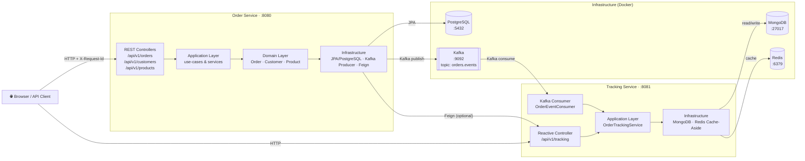

# Order Management & Tracking System

[](https://github.com/vizarce/order-management-tracking-system/actions)
[](https://adoptium.net/)
[](https://spring.io/projects/spring-boot)
[](LICENSE)

A dual-microservice CQRS system for managing and tracking orders in real time. The **Order Service** handles command-side operations (create/read orders, customers, products) and publishes events to Kafka; the **Tracking Service** consumes those events reactively and serves real-time order tracking via a MongoDB + Redis cache-aside pattern.

---

## Table of Contents

- [Architecture](#architecture)
- [Module Breakdown](#module-breakdown)
- [Prerequisites](#prerequisites)
- [Quick Start](#quick-start)
- [Detailed Setup](#detailed-setup)
  - [Local Development](#local-development)
  - [Environment Variables](#environment-variables)
- [API Reference](#api-reference)
  - [Order Service (port 8080)](#order-service-port-8080)
  - [Tracking Service (port 8081)](#tracking-service-port-8081)
- [Distributed Tracing](#distributed-tracing)
- [Running Tests](#running-tests)
- [Contributing](#contributing)
- [Security](#security)
- [License](#license)

---

## Architecture



### Data & Event Flow

1. A client sends `POST /api/v1/orders` to the **Order Service**.
2. The Order Service persists the order in **PostgreSQL** and publishes an `OrderCreatedEvent` to Kafka topic `orders.events`.
3. The **Tracking Service** consumes the event, writes the tracking record to **MongoDB**, and invalidates/populates the **Redis** cache.
4. A client polls `GET /api/v1/tracking/{orderId}` on the Tracking Service; the response is served from Redis on a cache hit (TTL 300 s) or from MongoDB on a miss.

---

## Module Breakdown

| Module | Role | Key Stack |
|---|---|---|
| `common` | Shared Kafka events, DTOs, and MDC constants used by both services | Plain Java 17 records |
| `order-service` | **Write side (CQRS Command)** — REST API, domain logic, JPA persistence, Kafka producer | Spring Boot 3, Spring Data JPA, PostgreSQL, Spring Kafka, OpenFeign |
| `tracking-service` | **Read side (CQRS Query)** — reactive REST API, Kafka consumer, MongoDB persistence, Redis cache | Spring WebFlux, Spring Data MongoDB Reactive, Spring Data Redis Reactive, Spring Kafka |

### Package layout

```
order-management-tracking-system/
├── common/                          # Shared library
│   └── src/main/java/com/ordertracking/common/
│       ├── event/                   # OrderCreatedEvent, OrderStatusUpdatedEvent
│       ├── dto/                     # OrderDto, CustomerDto, ProductDto, TrackingResponse
│       └── mdc/                     # MdcConstants (header & MDC key names)
│
├── order-service/                   # Spring Boot app — port 8080
│   └── src/main/java/com/ordertracking/orderservice/
│       ├── domain/                  # Aggregates (Order, Customer, Product), value objects, exceptions
│       ├── application/             # Use cases, application services, DTOs
│       ├── infrastructure/          # JPA adapters, Kafka producer, Feign client, MdcRequestFilter
│       └── web/                     # REST controllers, GlobalExceptionHandler
│
└── tracking-service/                # Spring Boot app — port 8081
    └── src/main/java/com/ordertracking/trackingservice/
        ├── domain/                  # OrderTracking model, TrackingStatus, repository interface
        ├── application/             # OrderTrackingService, DTOs
        ├── infrastructure/          # MongoDB adapter, Redis config, Kafka consumer, MdcWebFilter
        └── web/                     # Reactive TrackingController
```

---

## Prerequisites

| Tool | Version | Notes |
|---|---|---|
| JDK | 17+ | [Eclipse Temurin](https://adoptium.net/) recommended |
| Maven | 3.9+ | Bundled via `./mvnw` wrapper |
| Docker | 24+ | Required for Kafka, PostgreSQL, MongoDB, Redis |
| Docker Compose | v2 (plugin) | Ships with Docker Desktop |

---

## Quick Start

```bash
# 1. Clone the repository
git clone https://github.com/vizarce/order-management-tracking-system.git
cd order-management-tracking-system

# 2. Start all infrastructure services
docker compose up -d

# 3. Build the project (skip tests for a fast first run)
./mvnw clean package -DskipTests

# 4. Start the Order Service
./mvnw -pl order-service spring-boot:run

# 5. In a second terminal, start the Tracking Service
./mvnw -pl tracking-service spring-boot:run
```

Both services start within ~15 seconds. Verify with:

```bash
curl http://localhost:8080/actuator/health   # Order Service
curl http://localhost:8081/actuator/health   # Tracking Service
```

---

## Detailed Setup

### Local Development

#### 1. Infrastructure with Docker Compose

The project requires Kafka (+ Zookeeper), PostgreSQL, MongoDB, and Redis. Create a `docker-compose.yml` in the repository root:

```yaml
version: "3.9"

services:
  zookeeper:
    image: confluentinc/cp-zookeeper:7.6.0
    environment:
      ZOOKEEPER_CLIENT_PORT: 2181
    ports:
      - "2181:2181"

  kafka:
    image: confluentinc/cp-kafka:7.6.0
    depends_on: [zookeeper]
    environment:
      KAFKA_BROKER_ID: 1
      KAFKA_ZOOKEEPER_CONNECT: zookeeper:2181
      KAFKA_ADVERTISED_LISTENERS: PLAINTEXT://localhost:9092
      KAFKA_OFFSETS_TOPIC_REPLICATION_FACTOR: 1
    ports:
      - "9092:9092"

  postgres:
    image: postgres:16-alpine
    environment:
      POSTGRES_DB: orderdb
      POSTGRES_USER: postgres
      POSTGRES_PASSWORD: postgres
    ports:
      - "5432:5432"
    volumes:
      - postgres_data:/var/lib/postgresql/data

  mongodb:
    image: mongo:7.0
    ports:
      - "27017:27017"
    volumes:
      - mongo_data:/data/db

  redis:
    image: redis:7.2-alpine
    ports:
      - "6379:6379"

volumes:
  postgres_data:
  mongo_data:
```

Start all services:

```bash
docker compose up -d
docker compose ps          # verify all are "running"
```

#### 2. Create the Kafka Topic (first time only)

```bash
docker compose exec kafka \
  kafka-topics --create \
    --bootstrap-server localhost:9092 \
    --topic orders.events \
    --partitions 1 \
    --replication-factor 1
```

#### 3. Run each microservice

**Order Service**
```bash
./mvnw -pl order-service spring-boot:run
# or with a custom profile:
SPRING_PROFILES_ACTIVE=local ./mvnw -pl order-service spring-boot:run
```

**Tracking Service**
```bash
./mvnw -pl tracking-service spring-boot:run
```

#### 4. Tear down

```bash
docker compose down -v    # -v removes volumes (wipes data)
```

### Environment Variables

All defaults are set in each service's `src/main/resources/application.yml`. Override them with environment variables at runtime:

| Variable | Service | Default | Description |
|---|---|---|---|
| `SPRING_DATASOURCE_URL` | order-service | `jdbc:postgresql://localhost:5432/orderdb` | PostgreSQL JDBC URL |
| `SPRING_DATASOURCE_USERNAME` | order-service | `postgres` | PostgreSQL user |
| `SPRING_DATASOURCE_PASSWORD` | order-service | `postgres` | PostgreSQL password |
| `SPRING_KAFKA_BOOTSTRAP_SERVERS` | both | `localhost:9092` | Kafka broker address |
| `SPRING_DATA_MONGODB_URI` | tracking-service | `mongodb://localhost:27017/trackingdb` | MongoDB URI |
| `SPRING_DATA_REDIS_HOST` | tracking-service | `localhost` | Redis host |
| `SPRING_DATA_REDIS_PORT` | tracking-service | `6379` | Redis port |
| `SERVER_PORT` | order-service | `8080` | HTTP port |
| `SERVER_PORT` | tracking-service | `8081` | HTTP port |
| `CACHE_TTL_ORDER_TRACKING` | tracking-service | `300` | Redis TTL in seconds |

---

## API Reference

### Order Service (port 8080)

Base URL: `http://localhost:8080`

#### Customers

| Method | Path | Status | Description |
|---|---|---|---|
| `POST` | `/api/v1/customers` | `201 Created` | Create a new customer |
| `GET` | `/api/v1/customers` | `200 OK` | List all customers |
| `GET` | `/api/v1/customers/{id}` | `200 OK` | Get customer by ID |
| `DELETE` | `/api/v1/customers/{id}` | `204 No Content` | Delete a customer |

**POST `/api/v1/customers`**

Request:
```json
{
  "name": "Alice Smith",
  "email": "alice@example.com"
}
```

Response `201`:
```json
{
  "id": "a1b2c3d4-e5f6-7890-abcd-ef1234567890",
  "name": "Alice Smith",
  "email": "alice@example.com"
}
```

---

#### Products

| Method | Path | Status | Description |
|---|---|---|---|
| `POST` | `/api/v1/products` | `201 Created` | Create a new product |
| `GET` | `/api/v1/products` | `200 OK` | List all products |
| `GET` | `/api/v1/products/{id}` | `200 OK` | Get product by ID |

**POST `/api/v1/products`**

Request:
```json
{
  "name": "Wireless Headphones",
  "description": "Noise-cancelling over-ear headphones",
  "price": 149.99,
  "currency": "USD",
  "stockQuantity": 50
}
```

Response `201`:
```json
{
  "id": "prod-0001",
  "name": "Wireless Headphones",
  "description": "Noise-cancelling over-ear headphones",
  "price": 149.99,
  "currency": "USD",
  "stockQuantity": 50
}
```

---

#### Orders

| Method | Path | Status | Description |
|---|---|---|---|
| `POST` | `/api/v1/orders` | `202 Accepted` | Place a new order |
| `GET` | `/api/v1/orders/{id}` | `200 OK` | Get order details by ID |

**POST `/api/v1/orders`**

Request:
```json
{
  "customerId": "a1b2c3d4-e5f6-7890-abcd-ef1234567890",
  "items": [
    { "productId": "prod-0001", "quantity": 2 }
  ]
}
```

Response `202`:
```json
{
  "orderId": "ord-7777",
  "customerId": "a1b2c3d4-e5f6-7890-abcd-ef1234567890",
  "status": "PENDING",
  "totalAmount": 299.98,
  "items": [
    {
      "productId": "prod-0001",
      "productName": "Wireless Headphones",
      "quantity": 2,
      "unitPrice": 149.99
    }
  ],
  "createdAt": "2024-05-01T10:30:00"
}
```

**GET `/api/v1/orders/{id}`**

Response `200`:
```json
{
  "orderId": "ord-7777",
  "customerId": "a1b2c3d4-e5f6-7890-abcd-ef1234567890",
  "status": "CONFIRMED",
  "totalAmount": 299.98,
  "items": [
    {
      "productId": "prod-0001",
      "productName": "Wireless Headphones",
      "quantity": 2,
      "unitPrice": 149.99
    }
  ],
  "createdAt": "2024-05-01T10:30:00"
}
```

---

### Tracking Service (port 8081)

Base URL: `http://localhost:8081`

#### Tracking

| Method | Path | Status | Description |
|---|---|---|---|
| `GET` | `/api/v1/tracking/{orderId}` | `200 OK` | Get real-time tracking for an order |
| `GET` | `/api/v1/tracking/{orderId}` | `404 Not Found` | Order not yet consumed from Kafka |

**GET `/api/v1/tracking/{orderId}`**

Response `200`:
```json
{
  "orderId": "ord-7777",
  "customerId": "a1b2c3d4-e5f6-7890-abcd-ef1234567890",
  "status": "CONFIRMED",
  "totalAmount": 299.98,
  "items": [
    {
      "productId": "prod-0001",
      "productName": "Wireless Headphones",
      "quantity": 2,
      "unitPrice": 149.99
    }
  ],
  "createdAt": "2024-05-01T10:30:00.000Z",
  "updatedAt": "2024-05-01T10:30:05.000Z"
}
```

Response `404`:
```json
{
  "status": 404,
  "error": "Not Found",
  "message": "Tracking not found for orderId: ord-7777"
}
```

#### Error Responses

All services use a consistent error format for validation and domain errors:

| HTTP Status | Scenario |
|---|---|
| `400 Bad Request` | Validation failure (missing/invalid fields) |
| `404 Not Found` | Resource not found |
| `409 Conflict` | Insufficient stock or duplicate resource |
| `500 Internal Server Error` | Unexpected server error |

---

## Distributed Tracing

The system propagates a correlation identifier (`traceId`) across all boundaries — HTTP requests, Feign calls, and Kafka messages — using **SLF4J MDC**.

### How it works

| Boundary | Mechanism |
|---|---|
| Incoming HTTP request | `MdcRequestFilter` reads (or generates) `X-Request-Id` and `X-Trace-Id` headers, writes them to MDC |
| Outgoing Feign call | Feign `RequestInterceptor` copies MDC keys into request headers |
| Kafka producer | Serialises MDC keys (`traceId`, `requestId`, `userId`) into a custom `headers` field in the event JSON |
| Kafka consumer | `OrderEventConsumer` restores MDC from the Kafka record headers before processing |

### MDC keys

| MDC Key | HTTP Header | Description |
|---|---|---|
| `traceId` | `X-Trace-Id` | Logical trace identifier (UUID) |
| `requestId` | `X-Request-Id` | Per-request identifier |
| `userId` | `X-User-Id` | Optional user identifier |
| `method` | — | HTTP method |
| `uri` | — | Request URI |
| `service` | — | Service name |
| `topic` | — | Kafka topic (consumer side) |
| `partition` | — | Kafka partition |
| `offset` | — | Kafka offset |

### Filtering logs by traceId

**Kibana (Elasticsearch / ECS logs):**
```
traceId : "your-trace-id-here"
```
Or with KQL:
```
traceId: "550e8400-e29b-41d4-a716-446655440000"
```

**Grafana Loki (with Promtail):**
```logql
{app="order-service"} |= `"traceId":"550e8400-e29b-41d4-a716-446655440000"`
```
Or using a structured log label (if logback is configured with JSON output):
```logql
{app="order-service"} | json | traceId = "550e8400-e29b-41d4-a716-446655440000"
```

### Sending a traced request

Pass the `X-Trace-Id` header on any request; all downstream logs (including Kafka consumer logs in tracking-service) will carry the same value:

```bash
curl -H "X-Trace-Id: 550e8400-e29b-41d4-a716-446655440000" \
     -H "Content-Type: application/json" \
     -d '{"customerId":"...","items":[{"productId":"...","quantity":1}]}' \
     http://localhost:8080/api/v1/orders
```

---

## Running Tests

```bash
# All modules — unit + integration tests
./mvnw verify

# Single module
./mvnw verify -pl order-service
./mvnw verify -pl tracking-service

# Skip integration tests (unit only)
./mvnw test

# With coverage report (if Jacoco is configured)
./mvnw verify jacoco:report
```

Test reports are written to `<module>/target/surefire-reports/`.

---

## Contributing

Contributions are welcome! Please read [CONTRIBUTING.md](CONTRIBUTING.md) before submitting a pull request.

**Quick guide:**

1. Fork the repository and create a feature branch from `main`:
   ```bash
   git checkout -b feature/your-feature-name
   ```
2. Make your changes, following the existing code style and architecture.
3. Add or update tests to cover your changes.
4. Run the full test suite:
   ```bash
   ./mvnw verify
   ```
5. Open a pull request with a clear description of the change.

---

## Security

If you discover a security vulnerability, please do **not** open a public issue. Report it privately as described in [SECURITY.md](SECURITY.md).

---

## License

This project is licensed under the [MIT License](LICENSE).